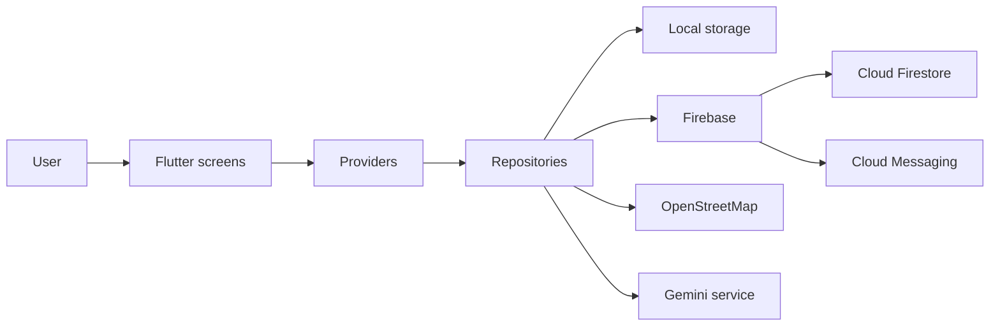

<div align="center">

**English** · [Português](README.pt-BR.md)


# CírioApp

Information and assistance for the Círio of Nazaré in Belém, Pará.

[](https://github.com/lianeheidemann/cirioapp_v2/actions/workflows/flutter-ci.yml)


[Download Android installer](https://drive.google.com/drive/folders/1aZ0Zg-uLfLyYJAsUqHGTTOmi-ysluc3D)

</div>


## Overview

CírioApp helps residents, visitors, and pilgrims access reliable information about the Círio of Nazaré. It combines event schedules, useful places, news, notifications, maps and an AI assistant in a single Android application.

The downloadable APK is a test distribution. It is not yet a Play Store production release.

## Features

- Event schedule and procession information.
- OpenStreetMap with points of interest and the user's current location.
- Real-time editorial news from Cloud Firestore.
- Push notifications through Firebase Cloud Messaging.
- On-device favorites and notification history.
- AI assistant with local semantic retrieval and Gemini.
- Portuguese and English interface.

## Technology

| Area | Stack |
|---|---|
| App | Flutter, Dart, Provider |
| Remote services | Firebase Firestore and Cloud Messaging |
| Maps and location | Flutter Map, OpenStreetMap, Geolocator |
| Local storage | Shared Preferences |
| AI | Gemini API and local embeddings |
| Tests | Flutter Test |
| Continuous integration | GitHub Actions |

## Architecture



The interface is organized by feature. Providers manage screen state, repositories coordinate data access, and services integrate external resources such as Firebase, maps and Gemini.

## Project structure

```text
cirioapp_v2/
├── android/                    # Android project and native configuration
├── assets/
│   ├── embeddings.json         # Local semantic-search embeddings
│   ├── gif/                    # README demonstrations
│   ├── icon/                   # Application icon
│   ├── images/                 # Interface and general images
│   └── news/                   # Local news assets
├── docs/                       # Technical documentation
├── lib/
│   ├── core/                   # Configuration, theme, Firebase and localization
│   ├── data/
│   │   ├── models/             # Domain and persistence models
│   │   ├── repositories/       # Data-access abstraction
│   │   ├── services/           # Gemini, Firebase and platform integrations
│   │   └── storage/            # Local persistence
│   ├── features/
│   │   ├── ai_assistant/       # AI assistant state and interface
│   │   ├── events/             # Event schedule
│   │   ├── favorites/          # Saved items
│   │   ├── map/                # Map, places and location
│   │   ├── news/               # Firestore news
│   │   └── notifications/      # Notification history and state
│   ├── shared/                 # Reusable UI components
│   └── main.dart               # Application entry point
├── test/                       # Unit and widget tests
├── .env.example                # Environment-variable template
├── firestore.indexes.json      # Firestore indexes
├── firestore.rules             # Firestore security rules
└── pubspec.yaml                # Flutter dependencies and assets
```

## Run locally

### Requirements

- Flutter with Dart 3+
- Android SDK
- Android device or emulator
- Firebase project for remote news and notifications
- Gemini API key for the AI assistant

```bash
git clone https://github.com/lianeheidemann/cirioapp_v2.git
cd cirioapp_v2
cp .env.example .env
flutter pub get
flutter run
```

On PowerShell, use:

```powershell
Copy-Item .env.example .env
```

## Configuration

### Firebase

The Android app uses the package `com.lianeheidemann.cirioapp`. To connect another Firebase project, run `flutterfire configure` and deploy the versioned Firestore rules and indexes.

News is read from the `news` collection. Notifications use the `cirio_updates` FCM topic. See [docs/firestore_news.md](docs/firestore_news.md) for the schema and publishing workflow.

### Gemini

Add a development key to `.env`:

```env
GEMINI_API_KEY=your_key
```

For production, provider credentials must be stored in a protected backend instead of being shipped inside the APK. This improvement is tracked in [issue #1](https://github.com/lianeheidemann/cirioapp_v2/issues/1).

## Quality and continuous integration

GitHub Actions automatically installs dependencies, runs static analysis and executes the test suite for pushes and pull requests to `main`.

Run the same checks locally:

```bash
dart analyze
flutter test
flutter build apk --debug
```

The badge at the top of this README shows whether the most recent continuous-integration run passed.

## Common problems

### `.env` file not found

Create it from the template before running Flutter:

```bash
cp .env.example .env
```

### Gemini assistant reports a missing key

Confirm that `GEMINI_API_KEY` exists in `.env`, then fully restart the application. Hot reload does not always reload environment assets.

### Firebase initialization fails

Confirm that the Android package matches the Firebase application and regenerate the configuration with `flutterfire configure` when using another project.

### Device is not detected

Run `flutter devices`, enable USB debugging on the Android device, or start an emulator before running `flutter run`.

### Location is unavailable

Enable the device location service and grant location permission. The map remains usable without current-location access, but user-position features will be limited.

### Tests fail because configuration is missing

Create `.env` from `.env.example`. The GitHub Actions workflow performs this step automatically.

## Roadmap and issues

Completed foundations:

- [x] Flutter application with feature-based organization.
- [x] Event schedule, maps, favorites, news and notifications.
- [x] Portuguese and English localization.
- [x] Local semantic retrieval with Gemini integration.
- [x] Unit and widget tests.
- [x] Continuous integration with GitHub Actions.
- [x] Downloadable Android test build.

Planned improvements:

- [ ] [Protect Gemini API calls with a backend service](https://github.com/lianeheidemann/cirioapp_v2/issues/1)
- [ ] [Document beta tests with Android users](https://github.com/lianeheidemann/cirioapp_v2/issues/2)
- [ ] [Improve accessibility and permission guidance](https://github.com/lianeheidemann/cirioapp_v2/issues/3)
- [ ] [Add integration tests for critical user flows](https://github.com/lianeheidemann/cirioapp_v2/issues/4)
- [ ] Publish a versioned GitHub Release with changelog and known limitations.
- [ ] Prepare a production distribution strategy.

See all open work on the [Issues page](https://github.com/lianeheidemann/cirioapp_v2/issues).

## Demonstration 

The demonstration below showcases the application's main user flows, including navigation, maps, favorites, news, and the AI assistant.

<p align="center">
  
</p>
