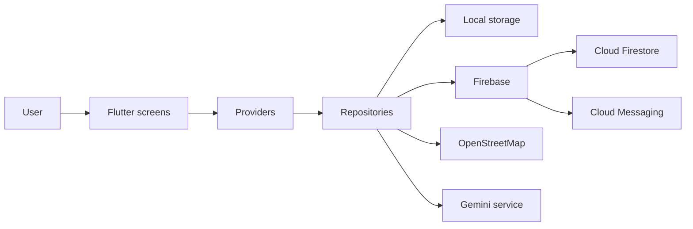

<div align="center">


# CírioApp

**Information and assistance for the Círio of Nazaré in Belém, Pará.**

[](https://github.com/lianeheidemann/cirioapp_v2/actions/workflows/flutter-ci.yml)


[Download Android installer](https://drive.google.com/drive/folders/1aZ0Zg-uLfLyYJAsUqHGTTOmi-ysluc3D) · [Report an issue](https://github.com/lianeheidemann/cirioapp_v2/issues)

</div>


## About the project

**CírioApp** brings together, in a single Android application, the information residents, visitors, and pilgrims need to follow the Círio of Nazaré: event schedules, points of interest on the map, real-time official news, push notifications, favorites, and an AI assistant trained on the context of the celebration.

> The downloadable APK is a test distribution and does not yet correspond to a production release on the Play Store.

## Table of contents

- [Features](#features)
- [Technology stack](#technology-stack)
- [Architecture](#architecture)
- [Project structure](#project-structure)
- [Getting started](#getting-started)
- [Configuration](#configuration)
- [Quality and continuous integration](#quality-and-continuous-integration)
- [Roadmap](#roadmap)
- [Demonstration](#demonstration)

## Features

- 📅 Event schedule and procession information.
- 🗺️ Map with OpenStreetMap, points of interest, and the user's current location.
- 📰 Real-time editorial news via Cloud Firestore.
- 🔔 Push notifications with Firebase Cloud Messaging.
- ⭐ On-device favorites and notification history.
- 🤖 AI assistant with local semantic retrieval and Gemini.
- 🌐 Portuguese and English interface.

## Technology stack

| Area | Stack |
|---|---|
| App | Flutter, Dart, Provider |
| Remote services | Firebase Firestore, Firebase Cloud Messaging |
| Maps and location | Flutter Map, OpenStreetMap, Geolocator |
| Local storage | Shared Preferences |
| AI | Gemini API and local embeddings |
| Tests | Flutter Test |
| Continuous integration | GitHub Actions |

## Architecture


```mermaid
flowchart LR
    U[User] --> UI[Flutter screens]
    UI --> P[Providers]
    P --> R[Repositories]

    R --> LS[Local storage]
    R --> FB[Firebase]
    R --> MAP[OpenStreetMap]
    R --> AI[Gemini service]

    FB --> FS[Cloud Firestore]
    FB --> FCM[Cloud Messaging]
```

The interface is organized by feature. Providers manage screen state, repositories coordinate data access, and services integrate external resources such as Firebase, maps, and Gemini.

## Project structure

```text
cirioapp_v2/
├── android/                    # Android project and native configuration
├── assets/
│   ├── embeddings.json         # Local semantic-search embeddings
│   ├── icon/                   # Application icon
│   ├── images/                 # Interface images
│   └── news/                   # Local news assets
├── docs/                       # Technical documentation
├── lib/
│   ├── core/                   # Configuration, theme, Firebase and localization
│   ├── data/
│   │   ├── models/             # Domain and persistence models
│   │   ├── repositories/       # Data-access abstraction
│   │   ├── services/           # Gemini, Firebase and platform integrations
│   │   └── local/              # Local persistence
│   ├── features/
│   │   ├── ai_assistant/       # AI assistant state and interface
│   │   ├── events/             # Event schedule
│   │   ├── favorites/          # Saved items
│   │   ├── map/                # Map, places and location
│   │   ├── news/                # Firestore news
│   │   └── notifications/      # Notification history and state
│   ├── shared/                 # Reusable UI components
│   └── main.dart                # Application entry point
├── test/                       # Unit and widget tests
├── .env.example                 # Environment-variable template
├── firestore.indexes.json       # Firestore indexes
├── firestore.rules              # Firestore security rules
└── pubspec.yaml                 # Flutter dependencies and assets
```

## Getting started

### Requirements

- Flutter with Dart 3+
- Android SDK
- Android device or emulator
- Firebase project for remote news and notifications
- Gemini API key for the AI assistant

### Steps

```bash
git clone https://github.com/lianeheidemann/cirioapp_v2.git
cd cirioapp_v2
cp .env.example .env
flutter pub get
flutter run
```

On PowerShell, use:

```powershell
Copy-Item .env.example .env
```

## Configuration

### Firebase

The Android app uses the package `com.lianeheidemann.cirioapp`. To connect another Firebase project, run `flutterfire configure` and deploy the versioned Firestore rules and indexes.

News is read from the `news` collection. Notifications use the `cirio_updates` FCM topic. See [docs/firestore_news.md](docs/firestore_news.md) for the schema and publishing workflow.

### Gemini

Add a development key to `.env`:

```env
GEMINI_API_KEY=your_key
```

For production, provider credentials must be stored in a protected backend instead of being shipped inside the APK. This improvement is tracked in [issue #1](https://github.com/lianeheidemann/cirioapp_v2/issues/1).

## Quality and continuous integration

GitHub Actions automatically installs dependencies, runs static analysis, and executes the test suite for pushes and pull requests to `main`.

Run the same checks locally:

```bash
dart analyze
flutter test
flutter build apk --debug
```

The badge at the top of this README shows whether the most recent continuous-integration run passed.

## Roadmap

Completed foundations:

- [x] Flutter application with feature-based organization.
- [x] Event schedule, maps, favorites, news, and notifications.
- [x] Portuguese and English localization.
- [x] Local semantic retrieval with Gemini integration.
- [x] Unit and widget tests.
- [x] Continuous integration with GitHub Actions.

Planned improvements:

- [ ] [Protect Gemini API calls with a backend service](https://github.com/lianeheidemann/cirioapp_v2/issues/1)
- [ ] Downloadable Android test build.
- [ ] [Document beta tests with Android users](https://github.com/lianeheidemann/cirioapp_v2/issues/2)
- [ ] [Improve accessibility and permission guidance](https://github.com/lianeheidemann/cirioapp_v2/issues/3)
- [ ] [Add integration tests for critical user flows](https://github.com/lianeheidemann/cirioapp_v2/issues/4)
- [ ] Publish a versioned GitHub Release with changelog and known limitations.
- [ ] Prepare a production distribution strategy.

See all open work on the [Issues page](https://github.com/lianeheidemann/cirioapp_v2/issues).

## Demonstration

The demonstration below showcases the application's main user flows, including navigation, maps, favorites, news, and the AI assistant.

<p align="center">
  
</p>

---

<div align="center">

Made for the Círio de Nazaré community 🙏

</div>
