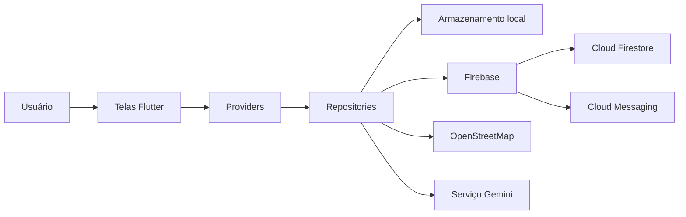

<div align="center">

[English](README.md) · **Português**


# CírioApp

Informação e assistência para o Círio de Nazaré em Belém do Pará.

[](https://github.com/lianeheidemann/cirioapp_v2/actions/workflows/flutter-ci.yml)


[Baixar instalador para Android](https://drive.google.com/drive/folders/1aZ0Zg-uLfLyYJAsUqHGTTOmi-ysluc3D)

</div>


## Visão geral

O CírioApp ajuda moradores, visitantes e peregrinos a acessar informações confiáveis sobre o Círio de Nazaré. O aplicativo reúne programação, locais úteis, notícias, notificações, mapas e um assistente de IA em uma única aplicação Android.

O APK disponível para download é uma distribuição de testes. Ele ainda não representa uma publicação de produção na Play Store.

## Funcionalidades

- Programação de eventos e informações sobre as procissões.
- OpenStreetMap com pontos de interesse e localização atual do usuário.
- Notícias editoriais em tempo real pelo Cloud Firestore.
- Notificações push pelo Firebase Cloud Messaging.
- Favoritos e histórico de notificações armazenados no dispositivo.
- Assistente de IA com recuperação semântica local e Gemini.
- Interface em português e inglês.

## Tecnologias

| Área | Stack |
|---|---|
| Aplicativo | Flutter, Dart e Provider |
| Serviços remotos | Firebase Firestore e Cloud Messaging |
| Mapas e localização | Flutter Map, OpenStreetMap e Geolocator |
| Persistência local | Shared Preferences |
| IA | Gemini API e embeddings locais |
| Testes | Flutter Test |
| Integração contínua | GitHub Actions |

## Arquitetura



A interface é organizada por funcionalidade. Os providers gerenciam o estado das telas, os repositories coordenam o acesso aos dados e os services integram recursos externos, como Firebase, mapas e Gemini.

## Estrutura do projeto

```text
cirioapp_v2/
├── android/                    # Projeto Android e configurações nativas
├── assets/
│   ├── embeddings.json        # Embeddings da busca semântica local
│   ├── gif/                    # Demonstrações usadas no README
│   ├── icon/                   # Ícone do aplicativo
│   ├── images/                 # Imagens da interface e imagens gerais
│   └── news/                   # Recursos locais de notícias
├── docs/                       # Documentação técnica
├── lib/
│   ├── core/                   # Configuração, tema, Firebase e localização
│   ├── data/
│   │   ├── models/             # Modelos de domínio e persistência
│   │   ├── repositories/       # Abstração do acesso aos dados
│   │   ├── services/           # Integrações com Gemini, Firebase e plataforma
│   │   └── storage/            # Persistência local
│   ├── features/
│   │   ├── ai_assistant/       # Estado e interface do assistente de IA
│   │   ├── events/             # Programação de eventos
│   │   ├── favorites/          # Itens salvos
│   │   ├── map/                # Mapa, locais e geolocalização
│   │   ├── news/               # Notícias do Firestore
│   │   └── notifications/      # Histórico e estado das notificações
│   ├── shared/                 # Componentes reutilizáveis de interface
│   └── main.dart               # Ponto de entrada da aplicação
├── test/                       # Testes unitários e de widgets
├── .env.example               # Modelo das variáveis de ambiente
├── firestore.indexes.json     # Índices do Firestore
├── firestore.rules            # Regras de segurança do Firestore
└── pubspec.yaml                # Dependências e assets do Flutter
```

## Executar localmente

### Requisitos

- Flutter com Dart 3+
- Android SDK
- Dispositivo Android ou emulador
- Projeto Firebase para notícias e notificações remotas
- Chave da API Gemini para o assistente de IA

```bash
git clone https://github.com/lianeheidemann/cirioapp_v2.git
cd cirioapp_v2
cp .env.example .env
flutter pub get
flutter run
```

No PowerShell, use:

```powershell
Copy-Item .env.example .env
```

## Configuração

### Firebase

O aplicativo Android utiliza o pacote `com.lianeheidemann.cirioapp`. Para conectar outro projeto Firebase, execute `flutterfire configure` e publique as regras e os índices versionados do Firestore.

As notícias são lidas da coleção `news`. As notificações utilizam o tópico FCM `cirio_updates`. Consulte [docs/firestore_news.md](docs/firestore_news.md) para ver o esquema e o fluxo de publicação.

### Gemini

Adicione uma chave de desenvolvimento ao arquivo `.env`:

```env
GEMINI_API_KEY=sua_chave
```

Em produção, as credenciais do provedor devem permanecer em um backend protegido, e não dentro do APK. Essa melhoria está registrada na [issue #1](https://github.com/lianeheidemann/cirioapp_v2/issues/1).

## Qualidade e integração contínua

O GitHub Actions instala as dependências, executa a análise estática e roda os testes automaticamente em pushes e pull requests para a branch `main`.

Execute as mesmas verificações localmente:

```bash
dart analyze
flutter test
flutter build apk --debug
```

O badge no início do README indica se a execução mais recente da integração contínua foi concluída com sucesso.

## Problemas comuns

### Arquivo `.env` não encontrado

Crie o arquivo a partir do modelo antes de executar o Flutter:

```bash
cp .env.example .env
```

### O assistente Gemini informa que a chave está ausente

Confirme que `GEMINI_API_KEY` existe no `.env` e reinicie completamente a aplicação. O hot reload nem sempre recarrega os assets de ambiente.

### Falha na inicialização do Firebase

Confirme se o pacote Android corresponde ao aplicativo cadastrado no Firebase. Ao utilizar outro projeto, gere novamente a configuração com `flutterfire configure`.

### Dispositivo não detectado

Execute `flutter devices`, ative a depuração USB no Android ou inicie um emulador antes de executar `flutter run`.

### Localização indisponível

Ative a localização do aparelho e conceda a permissão. O mapa pode continuar funcionando sem acesso à posição atual, mas os recursos de localização ficam limitados.

### Testes falham por falta de configuração

Crie o `.env` a partir do `.env.example`. O workflow do GitHub Actions realiza essa etapa automaticamente.

## Roadmap e issues

Bases concluídas:

- [x] Aplicação Flutter organizada por funcionalidades.
- [x] Programação, mapas, favoritos, notícias e notificações.
- [x] Localização em português e inglês.
- [x] Recuperação semântica local com integração ao Gemini.
- [x] Testes unitários e de widgets.
- [x] Integração contínua com GitHub Actions.
- [x] Build Android de testes disponível para download.

Melhorias planejadas:

- [ ] [Proteger chamadas ao Gemini com um backend](https://github.com/lianeheidemann/cirioapp_v2/issues/1)
- [ ] [Documentar testes beta com usuários Android](https://github.com/lianeheidemann/cirioapp_v2/issues/2)
- [ ] [Melhorar acessibilidade e explicações de permissões](https://github.com/lianeheidemann/cirioapp_v2/issues/3)
- [ ] [Adicionar testes de integração para fluxos críticos](https://github.com/lianeheidemann/cirioapp_v2/issues/4)
- [ ] Publicar uma GitHub Release versionada com changelog e limitações conhecidas.
- [ ] Preparar uma estratégia de distribuição de produção.

Consulte todo o trabalho aberto na página de [Issues](https://github.com/lianeheidemann/cirioapp_v2/issues).

## Convenção de commits

Os novos commits devem usar mensagens curtas e específicas:

```text
feat: add event filtering
fix: handle denied location permission
test: cover favorites persistence
docs: document Firebase setup
ci: add Flutter test workflow
```

Sempre que possível, cada commit deve representar uma única alteração compreensível.

## Demonstração

<p align="center">
  
</p>
